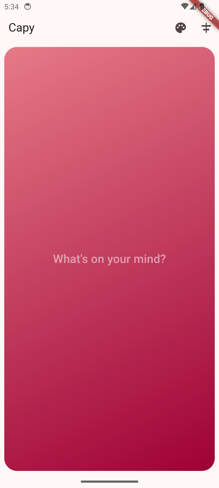
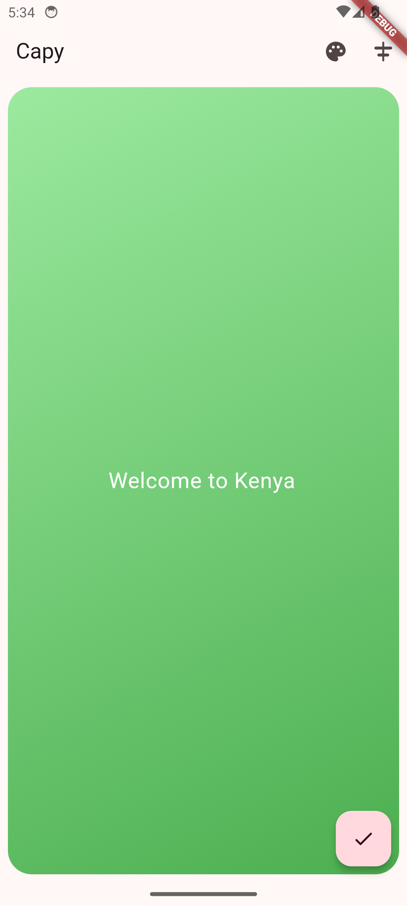

# Capy

  

    
Theme 1

    
  

  

    
Theme 2

    
  

## Overview

Capy is a Flutter mobile application that allows users to capture and save
screenshots with customizable captions. It provides features such as dynamic
background colors, text alignment options, and saving images to the device's
gallery.

## Features

- Capture screenshots with customizable captions
- Choose from a variety of background colors
- Align text within the caption input field
- Save captured images to the device's gallery

## Installation

To run the Capy app locally, follow these steps:

1. Clone this repository to your local machine.
2. Ensure you have Flutter installed. If not, follow the
   [Flutter installation guide](https://flutter.dev/docs/get-started/install).
3. Open the project directory in your preferred IDE.
4. Run `flutter pub get` to install dependencies.
5. Connect a device or set up an emulator.
6. Run `flutter run` to launch the app.

## Contributing

Contributions are welcome! If you'd like to contribute to the Capy project,
please follow these steps:

1. Fork the repository.
2. Create a new branch for your feature or bug fix.
3. Make your changes and ensure they are tested.
4. Commit your changes and push them to your fork.
5. Submit a pull request with a detailed description of your changes.

## License

This project is licensed under the MIT License. See the [LICENSE](LICENSE) file
for details.
